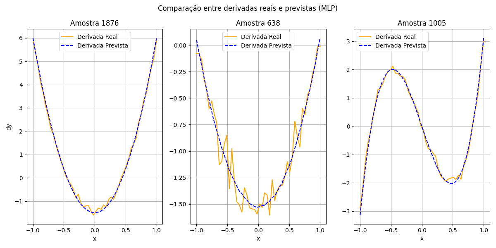

# Redes Neurais Simples

Nesta atividade foi feita a implementação de redes neurais simples para interpolação de funções básicas, como parte do estudo de introdução a redes neurais e aprendizado supervisionado. Tendo como objetivo implementar redes neurais para interpolar funções, utilizando o  **PyTorch** e  **scikit-learn**. e Por fim, a rede fez cálculo des derivadas numéricas.

 Para a atividade  foi feito um treina de redes neurais para **interpolarem funções matemáticas** (por exemplo, seno) em um domínio específico e analisar sua capacidade de ajuste e generalização.As variaveis de teste foram:
  - Número de camadas ocultas.
  - Número de neurônios por camada.
  - Número de épocas.
  - Batch size.
  - Número de pontos de treino.
  ## Resultado - Gráfico

## Resultado – Interpolação da Função Seno

Abaixo está o gráfico gerado pela interpolação da função seno:

 
  ## Gráfico das Derivadas

Abaixo está o gráfico gerado com os dados da função derivada:

 

  

