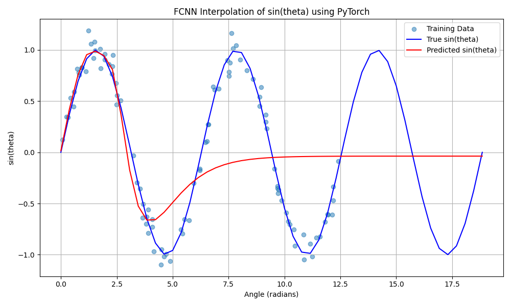

# Redes Neurais Simples

## Hiperparâmetros Usados

- Número de épocas.
- Batch size.
- Número de pontos de treino.

---

## Resultados - Gráficos

### Interpolação da Função Seno

Abaixo está o gráfico gerado pela interpolação da função seno:

---

###  Gráfico das Derivadas

Abaixo está o gráfico gerado com os dados da função derivada:

