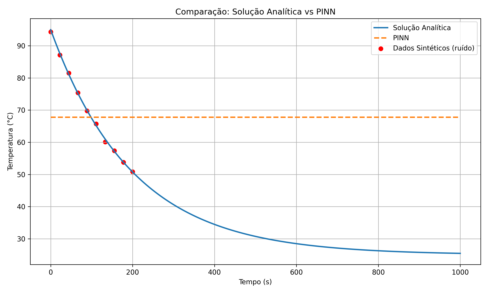

# 📚 Atividade 4 — Physics Informed Neural Networks (PINNs)

# Resfriamento de uma Caneca de Café com Redes Neurais e PINNs ☕

Este projeto resolve a equação diferencial do resfriamento de uma caneca de café usando diferentes métodos:

- Solução Analítica
- Método de Runge-Kutta de 4ª ordem (RK4)
- Rede Neural de Regressão Simples
- PINN (Physics-Informed Neural Network)

---

## 🔧 Equação Modelada

A equação diferencial ordinária (EDO) do resfriamento é:

$$
\frac{dT}{dt} = r(T_{amb} - T)
$$

---

## 📌 Etapas

1. ✅ Solução analítica da EDO.
2. ✅ Solução numérica com RK4.
3. ✅ Geração de dados sintéticos com ruído.
4. ✅ Ajuste com Rede Neural de Regressão Simples.
5. ✅ Treinamento de PINN com conhecimento da equação.
6. ✅ PINN sem saber o valor da taxa \( r \) (descobrindo ela automaticamente!).

---

## 📈 Resultados

### 🔹 Comparação: Solução Analítica vs PINN + Dados Sintéticos

---

---

