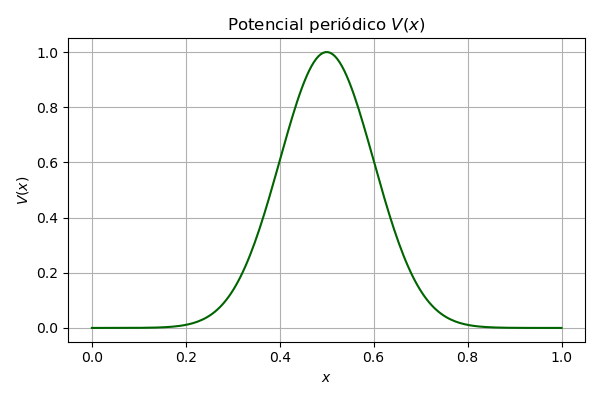

# 🔬 Atividade 6 — Estrutura de Bandas com Equação de Schrödinger

Nesta atividade, exploramos a estrutura de bandas eletrônicas em materiais cristalinos, resolvendo a equação de Schrödinger com potenciais periódicos usando a expansão da função de Bloch em termos de ondas planas.

O objetivo é obter a equação central, construir o Hamiltoniano em forma matricial e diagonalizá-lo para diferentes potenciais periódicos, visualizando as bandas de energia permitidas nos sólidos.

---

## 📚 Referência Teórica

Utilizamos as **notas de aula do Prof. Rodrigo Capaz**, especialmente a **Seção 5.4** sobre a equação central de Bloch.
---

## 🧮 Etapas

### ✅ Equação Central

A equação de Schrödinger para um potencial periódico \( V(\vec{r} + \vec{R}) = V(\vec{r}) \) é escrita na base de ondas planas, levando à equação central em forma matricial. A diagonalização dessa matriz permite obter os valores de energia \( E_n(\vec{k}) \) para diferentes vetores de onda \( \vec{k} \).

---

## 🧪 Exercícios

### ⚙️ Exercício 1 — Caso 1D Simples

- Considera um cristal 1D com passo \( a = 1 \), utilizando três componentes de onda \( G = -2\pi/a, 0, +2\pi/a \).
- Define-se um potencial constante \( V_0 \) que gera acoplamento entre os estados.
- O Hamiltoniano 3×3 é diagonalizado para diversos valores de \( k \) no 1º Brillouin.

---

### ⚙️ Exercício 2 — Caso 1D com V(x)

- Considera um potencial real periódico, como:
  
  math
  V(x) = -A \exp\left(-\frac{(x - 1)^2}{2\sigma^2}\right) - B \exp\left(-\frac{(x + 1)^2}{2\sigma^2}\right)

  ### Gráfico do Potencial \( V(x) \)

Abaixo está o gráfico da função potencial \( V(x) \), uma gaussiana centrada em 0.5 com largura ajustada por \( \gamma = 50 \):

